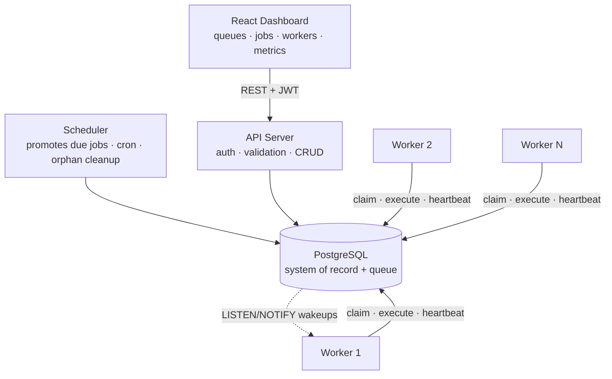
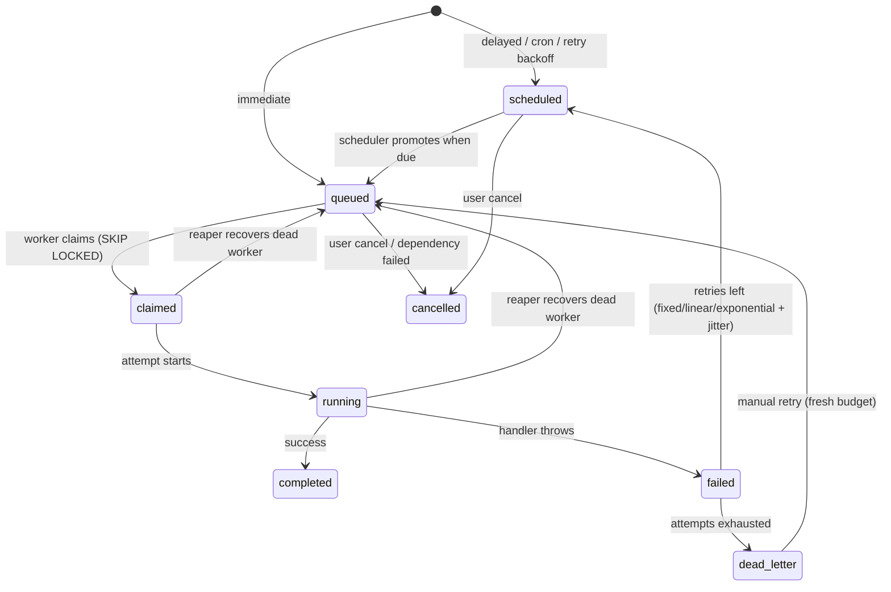
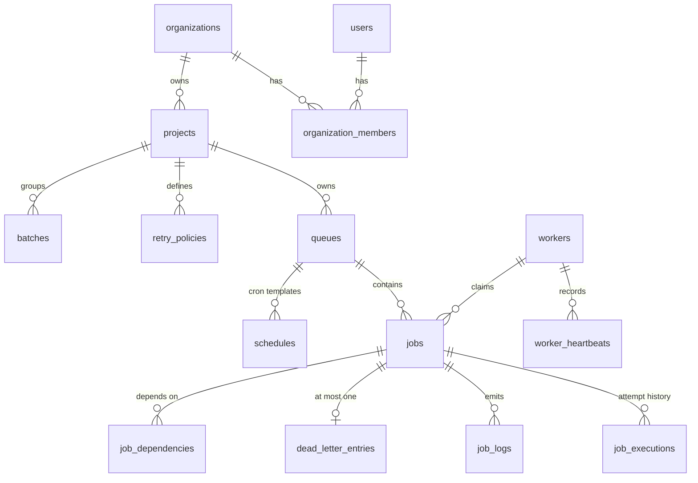

# Distributed Job Scheduler

A production-inspired distributed job scheduling platform: REST API,
horizontally scalable workers with atomic job claiming, a scheduler for
delayed/recurring jobs, retries with backoff, a Dead Letter Queue, and a
live React dashboard — built on PostgreSQL as both system-of-record and
queue (`FOR UPDATE SKIP LOCKED`).

## Architecture



Three independent processes communicate **only through PostgreSQL** — no
internal RPC. Full rationale in [docs/01-architecture.md](docs/01-architecture.md)
and 18 recorded trade-offs in [docs/02-design-decisions.md](docs/02-design-decisions.md).

## Job lifecycle



## ER diagram (core entities)



Schema deep-dive (keys, indexes, normalization, cascades, performance):
[docs/03-database.md](docs/03-database.md).

## Quick start

Prerequisites: **Node.js ≥ 22**, **Docker Desktop**, **Git**.

```bash
git clone https://github.com/nandha-07/distributed-job-scheduler.git
cd distributed-job-scheduler
npm install

# 1. Local config (then set JWT_SECRET in .env — generator below)
cp .env.example .env
node -e "console.log(require('crypto').randomBytes(48).toString('hex'))"

# 2. Database (Docker) + schema
docker compose up -d
npm run db:migrate

# 3. Run the four processes (separate terminals)
npm run dev:api          # REST API          → http://localhost:3000
npm run dev:worker       # run several copies to see distribution
npm run dev:scheduler    # promotions + cron
npm run dev:dashboard    # dashboard         → http://localhost:5173
```

Open http://localhost:5173, **create an account**, and everything —
projects, queues, jobs (immediate/delayed/batch/dependent), cron
schedules, DLQ retries, queue settings — is driven from the UI.

Try the reliability demo: create a job with **Simulate failure** checked
and watch it retry with exponential backoff, dead-letter after 3
attempts, then resurrect it from the *Dead letters* tab. Kill a worker
terminal mid-job and watch another worker's reaper recover it (~40s).

## Features

**Core:** JWT auth (bcrypt) · orgs → projects → queues · queue priority,
concurrency limits, pause/resume, statistics · immediate / delayed /
scheduled / recurring (cron) / batch jobs · idempotency keys · atomic
claiming via `FOR UPDATE SKIP LOCKED` (zero-duplicate, race-tested) ·
heartbeats + automatic crash recovery (reaper) · graceful shutdown ·
retries (fixed/linear/exponential + jitter) · Dead Letter Queue with
manual retry · per-attempt execution history, logs and metrics ·
responsive dashboard with live polling and a throughput chart.

**Bonus:** workflow dependencies (with orphan cancellation) · per-queue
rate limiting · role-based access control (member/admin/owner) ·
event-driven execution (Postgres LISTEN/NOTIFY hybrid) · distributed
locking (see [docs/05](docs/05-scaling-and-locking.md)) · queue sharding
design ([docs/05](docs/05-scaling-and-locking.md)).

## Testing

```bash
npm test
```

Unit tests (retry math, cron, state machine) always run. Integration
tests (concurrent-claim race, dependency gating, retry→DLQ→manual-retry
flow, rate limiting, auth API) run against the local Postgres and skip
themselves cleanly if it isn't up. Tests create isolated random-named
orgs and clean up via cascade.

> **Stop `dev:worker` and `dev:scheduler` before running tests.** Live
> workers share the database and will race the test suite for its own
> test jobs (the LISTEN/NOTIFY wakeup makes them win within milliseconds).
> The production-grade alternative is a dedicated test database; for this
> project's scope, stopping the fleet is the documented convention.

## Documentation

| Document | Contents |
|---|---|
| [docs/01-architecture.md](docs/01-architecture.md) | processes, repo layout, lifecycle, reliability model |
| [docs/02-design-decisions.md](docs/02-design-decisions.md) | 18 recorded trade-offs (incl. 2 bugs found by testing and their fixes) |
| [docs/03-database.md](docs/03-database.md) | schema: keys, indexes, normalization, cascades, performance |
| [docs/04-api.md](docs/04-api.md) | REST conventions + full endpoint reference |
| [docs/05-scaling-and-locking.md](docs/05-scaling-and-locking.md) | locking strategy, sharding design |

## Project structure

```
apps/
  api/        REST API (routes → controllers → services → repositories)
  worker/     claims & executes jobs; heartbeats; reaper; LISTEN wakeups
  scheduler/  promotes due jobs; materializes cron; cancels orphans
  dashboard/  React + Vite UI
packages/
  core/       pure domain logic: state machine, retry math, cron (unit-tested)
  db/         migrations, connection pool, all SQL (repository pattern)
  config/     env loading + validation (fail-fast)
docs/         architecture, decisions, database, API, scaling
```
